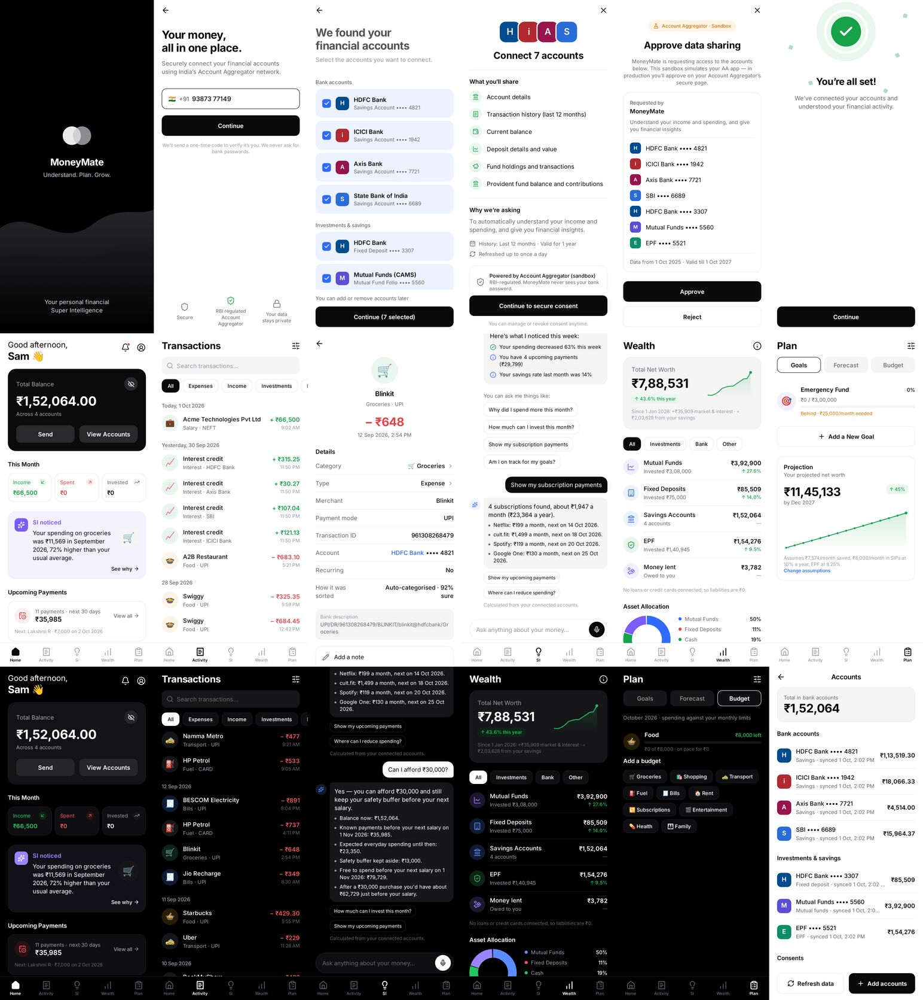

# Finance Buddy

Personal financial intelligence, powered by **SI (Super Intelligence)** and connected through India's
**Account Aggregator (AA)** network. One codebase for **iOS, Android and web**.



## What works today

| Area | Status |
|---|---|
| Phone + OTP sign-in, device sessions, sign out, delete account | Working |
| AA journey: discover accounts → choose → consent → approve/reject → sync | Working against the **AA sandbox** (test persona) |
| Home: balance, this month, SI insight, upcoming payments, net worth | Working |
| Activity: grouped list, search, filters, detail, re-categorise, change type, notes, split, recurring | Working |
| SI: weekly brief + questions answered from the Finance Engine (never invents numbers) | Working |
| Wealth: net worth, holdings, returns, allocation, trend (market vs. savings labelled) | Working |
| Plan: goals with "what if", cash forecast, net-worth projection, budgets, editable assumptions | Working |
| Accounts & consent management (revoke deletes shared data), notifications, settings | Working |
| Light + dark themes, loading / empty / error / offline / partial-data states | Working |

What still needs business setup (not code): a licensed AA partner's UAT/production credentials and
an SMS provider for OTP. See [PLAN.md](PLAN.md).

## Live

**https://finance-buddy-theta.vercel.app** (sandbox mode: OTP `123456`, test bank data).

| Piece | Where |
|---|---|
| Web app + API | Vercel project `finance-buddy` (region Mumbai `bom1`). The API is served from the same domain under `/api`. |
| Database | Supabase project `Finance-buddy` (Postgres 17, `ap-south-1`). Schema in `supabase/migrations/`. |
| Deploys | Every push to the production branch builds with `npm run vercel-build` (`scripts/vercel-build.mjs`). |

### Keys and where they live

No secret is stored in this repository. Production values are set in **Vercel → Project → Settings → Environment Variables**:

| Variable | What it is |
|---|---|
| `DATABASE_URL` | Supabase pooler URL for the `fb_api` database login (transaction mode, port 6543) |
| `DATA_ENCRYPTION_KEY` | 32-byte key that encrypts phone numbers, names, narrations, notes and holdings (AES-256-GCM) |
| `AA_WEBHOOK_SECRET` | Verifies Account Aggregator webhook signatures |
| `SANDBOX_MODE` | `true` = test OTP + sandbox AA. Set to `false` only once real SMS and AA partner keys are added |
| `ANTHROPIC_API_KEY` | Optional. Lets Claude word SI answers (numbers still come only from the Finance Engine) |

Database security: Row Level Security is on for every table, the public `anon`/`authenticated` roles have no
access, and only the API's own `fb_api` login can read or write. Browsers never talk to the database directly.
To rotate the database password: Supabase SQL editor → `ALTER ROLE fb_api WITH PASSWORD '<new>';`, then update
`DATABASE_URL` in Vercel and redeploy.

## Run it locally

Requires **Node 22.13+**. Locally the API uses an embedded Postgres (PGlite) in `apps/api/data/`, so no setup is needed.

```bash
npm install
cp apps/api/.env.example apps/api/.env   # optional; defaults work for local use
npm run dev:web                           # API on :4000 + web app on http://localhost:8081
```

- **Sign in:** any Indian mobile number (e.g. `98765 43210`), OTP **`123456`** (development mode).
- **Sandbox data:** the AA sandbox returns 12 months of realistic history (salary, rent, SIPs, food, bills,
  loans to friends, refunds, transfers) for a test persona ("Sam Jo"), so every screen has real, reconciled numbers.

### On your phone (iOS / Android)

```bash
npm run dev            # API + Expo dev server
```

Install **Expo Go**, scan the QR code, and make sure the phone is on the same Wi-Fi as your computer.
The app finds the API automatically. To point at another server, set `EXPO_PUBLIC_API_URL`.

Store builds (TestFlight / Play Store) use EAS: `npx eas-cli@latest build` from `apps/mobile`.

### Optional: Claude for SI phrasing

Set `ANTHROPIC_API_KEY` in `apps/api/.env`. SI still gets every number from the Finance Engine; Claude only
words the answer, and any answer containing a number not in the engine's facts is rejected and replaced by
the deterministic answer. Without a key, SI uses deterministic templates.

## Tests

```bash
npm test                 # Finance Engine unit tests + API end-to-end flow tests
npm run typecheck        # core, API and app
node e2e/walkthrough.mjs # scripted browser walkthrough (needs API on :4000 and the web build served on :8081)
```

To run the browser walkthrough: `cd apps/mobile && npx expo export --platform web`, then
`node e2e/serve-web.mjs apps/mobile/dist 8081` (from the repo root), then run the walkthrough.

## Project structure

```
apps/mobile      Expo Router app (iOS, Android, web)
  src/app        Screens (file-based routes): onboarding/, (tabs)/, transaction/, goal/, settings…
  src/ui         Design system components (text, buttons, cards, chips, sheets, states)
  src/theme      Design tokens — light (#FFFFFF) and dark (#000000) share one semantic set
apps/api         Node + Hono API, Postgres (Supabase; PGlite locally), AA integration, ingestion, SI service
  src/aa         AA provider interface + sandbox provider (swap point for the real partner)
  src/vercel.ts  Vercel Function entry
packages/core    Finance Engine, Forecast Engine, SI tools, shared API types (pure + tested)
supabase         Database migrations (schema, RLS, API role)
scripts          Vercel build (web app + API function)
e2e              Browser walkthrough
```

## Product rules enforced in code

- All money is integer paise; all arithmetic is in `packages/core` and unit-tested.
- Investments aren't expenses; own-account transfers aren't income or spending; loans are tracked separately.
- The bank-reported balance is the source of truth; history is never edited to force a match.
- SI only states facts produced by engine tools. If there isn't enough data, it says so.
- No bank passwords, ever. Sensitive fields are encrypted at rest (AES-256-GCM).

## Brand and bank logos

Every Vercel build downloads the real app icon for each merchant and bank from its Google Play listing
(website icon as a fallback) with `scripts/fetch-logos.mjs`. Locally, run `npm run logos:fetch`.
The build log lists where each logo came from; anything not found falls back to a 3D category icon
(merchants) or the bank's mark.

To use your own image instead, drop it (square PNG, ideally 256×256) into `apps/mobile/assets/logos/`, named by key:

- Merchants: the merchant key from `packages/core/src/merchants.ts`, e.g. `swiggy.png`, `blinkit.png`, `rapido.png`.
- Banks: `bank-<id>`, e.g. `bank-hdfc.png`, `bank-icici.png`, `bank-axis.png`, `bank-sbi.png`, `bank-cams.png`, `bank-epfo.png`.

Then run `npm run logos`. Anything without a logo falls back to a 3D category icon (merchants) or a bank monogram.

## Credits

- 3D icons: [Microsoft Fluent Emoji](https://github.com/microsoft/fluentui-emoji) (MIT).
- Bank and merchant logos: [Simple Icons](https://simpleicons.org) (CC0). Logos are trademarks of their
  owners and are shown only to identify the bank or merchant. Banks without a logo there (e.g. SBI) use a monogram.
